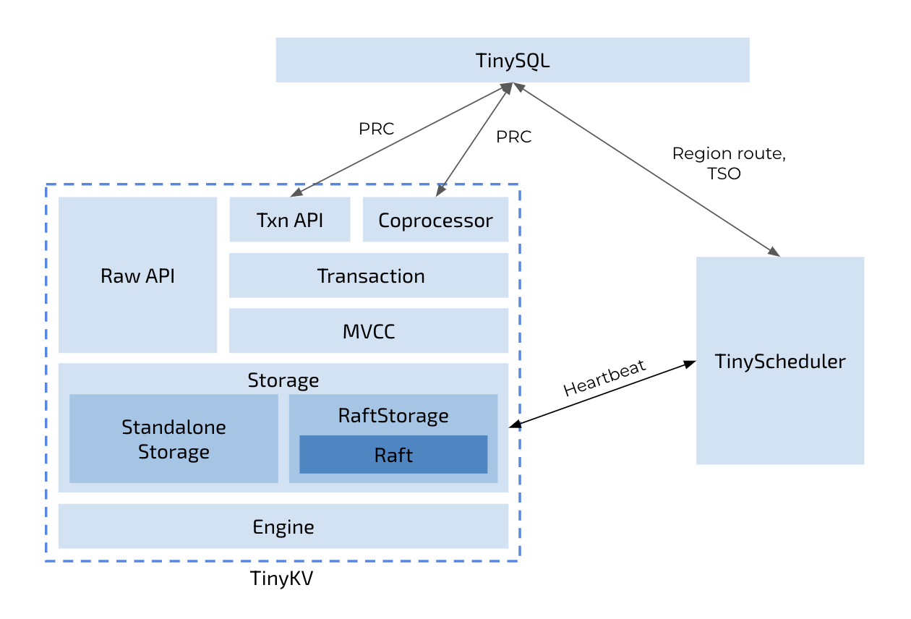

# The TinyKV

### Performance Testing

    Project1 :  8.86s

### Overview of the code



Same as the architecture of TiDB + TiKV + PD that separates the storage and computation, TinyKV only focuses on the storage layer of a distributed database system. If you are also interested in SQL layer, see [TinySQL](https://github.com/pingcap-incubator/tinysql). Besides that, there is a component called TinyScheduler as a center control of the whole TinyKV cluster, which collects information from the heartbeats of TinyKV. After that, the TinyScheduler can generate some scheduling tasks and distribute them to the TinyKV instances. All of them are communicated by RPC.

The whole project is organized into the following directories:

- `kv`: implementation of the TinyKV key/value store.
- `proto`: all communication between nodes and processes uses Protocol Buffers over gRPC. This package contains the protocol definitions used by TinyKV, and generated Go code for using them.
- `raft`: implementation of the Raft distributed consensus algorithm, used in TinyKV.
- `scheduler`: implementation of the TinyScheduler which is responsible for managing TinyKV nodes and for generating timestamps.
- `log`: log utility to output log base	on level.

### Course material

Please follow the course material to learn the background knowledge and finish code step by step.

- [Project1 - StandaloneKV](doc/project1-StandaloneKV.md)
- [Project2 - RaftKV](doc/project2-RaftKV.md)
- [Project3 - MultiRaftKV](doc/project3-MultiRaftKV.md)
- [Project4 - Transaction](doc/project4-Transaction.md)

## Deploy a cluster

After you finished the whole implementation, it's runnable now. You can try TinyKV by deploying a real cluster, and interact with it through TinySQL.

### Build

```
make
```

It builds the binary of `tinykv-server` and `tinyscheduler-server` to `bin` dir.

### Run

Put the binary of `tinyscheduler-server`, `tinykv-server` and `tinysql-server` into a single dir.

Under the binary dir, run the following commands:

```
mkdir -p data
```

```
./tinyscheduler-server
```

```
./tinykv-server -path=data
```

```
./tinysql-server --store=tikv --path="127.0.0.1:2379"
```

### Play

```
mysql -u root -h 127.0.0.1 -P 4000
```
